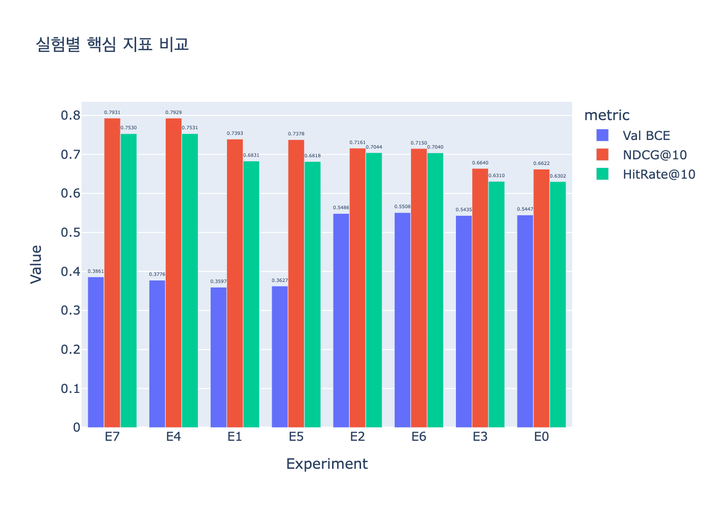

#  AutoInt 추천 시스템 프로젝트 (AutoInt Recommendation System)

이 프로젝트는 **AutoInt** 및 **AutoInt_MLP** 모델을 사용하여 영화/콘텐츠 추천 시스템을 구현하고, 학습된 모델을 **Streamlit** 대시보드를 통해 시각화하는 프로젝트입니다.

---

##  1. 가상환경 설정 (Environment Setup)

권장 환경은 **Python 3.11** 입니다. 기존 환경이 꼬였으면 새 가상환경을 만든 뒤 이 순서로 다시 설치하는 편이 가장 안전합니다.

### `venv` 기준

```bash
# 프로젝트 루트로 이동
cd /Users/jkyu/aiffel/AIFFEL_QUEST/MainQuest/10_rcm_node_aiffel

# 1. 새 가상환경 생성
python3.11 -m venv .venv

# 2. 가상환경 활성화
source .venv/bin/activate

# 3. pip 최신화
python -m pip install --upgrade pip setuptools wheel

# 4. 의존성 설치
pip install -r requirements.txt

# 5. 로컬 패키지 등록
pip install -e .
```

### `conda` 기준

```bash
conda create -n ds8_rcmm python=3.11 -y
conda activate ds8_rcmm
python -m pip install --upgrade pip setuptools wheel
pip install -r requirements.txt
pip install -e .
```

### 설치 확인

```bash
python -c "from autoint.tf_device import configure_tensorflow; configure_tensorflow()"
python -c "from autoint import AutoIntModel, AutoIntMLPModel"
```

`tensorflow-metal`은 macOS에서만 설치되도록 설정되어 있으며, GPU가 잡히면 TensorFlow가 Apple Metal 장치를 자동으로 사용합니다.

---

##  2. 실행 방법 (Usage)

프로젝트 폴더 내에서 아래 명령어를 입력하면 웹 인터페이스(Streamlit)를 통해 추천 시스템을 확인할 수 있습니다.

* **`show_st.py`**: Lecture 모델 (**AutoInt**) 스트림릿 실행 코드
* **`show_st_plus.py`**: Project 모델 (**AutoInt_MLP**) 스트림릿 실행 코드

```bash
# 프로젝트 루트에서 실행

# 기본 AutoInt 모델 실행
streamlit run autoint/show_st.py

# 성능 개선된 AutoInt_MLP 모델 실행
streamlit run autoint/show_st_plus.py
```

---

## 3. 노트북 코드 안내 (Notebooks)

학습 및 데이터 처리는 아래 순서대로 구성되어 있습니다.

| 순서 | 파일명 | 설명 |
| --- | --- | --- |
| 1 | `data_EDA.ipynb` | 데이터를 로드하고 기초적인 탐색적 데이터 분석(EDA) 수행 |
| 2 | `data_prepro.ipynb` | 학습용 데이터 전처리 (기본 전처리 데이터는 이미 제공됨) |
| 3 | `autoint_train.ipynb` | **AutoInt** 모델 학습 및 가중치 저장 |
| 4 | `autoint_mlp_train.ipynb` | **AutoInt_MLP** 모델 학습 및 가중치 저장 |
| 5 | `model_load_test.ipynb` | **모델 로드 및 정상 작동 여부 디버깅 코드** |

> **⚠️ 중요**: Streamlit 실행 중 에러가 발생하면 디버깅이 어려울 수 있습니다. 모델 수정 후에는 `model_load_test.ipynb`에서 가중치가 올바르게 로드되는지 먼저 확인해 보세요.

---

## Feature Engineering 을 통한 성능 향상 실험 요약

`AutoInt_MLP` 기반으로 총 8개 조합 실험(`E0~E7`)을 수행했습니다.  
2가지 수준을 가진 3개의 변수를 조합하여 비교했습니다.
기존 모델의 결과는 E0 으로 실험의 베이스라인입니다.

- `preference` : 영화 선호의 기준
  - `p0`: 평점 4점 이상을 선호로 간주
  - `p1`: 4~5점은 선호, 1~2점은 비선호, 3점은 제외
- `recency` : 최근 영화 시청 여부
  - `r0`: 사용자 전체 이력 사용
  - `r1`: 사용자별 최근 6개월 이력만 사용
- `genre_rewatch` : 해당 장르를 다시 보았는지 여부
  - `g0`: 장르 재시청 피처 사용 안 함
  - `g1`: 장르 재시청 여부를 이진 피처로 추가

모든 실험은 동일한 모델 구조와 하이퍼파라미터 조건에서 비교했습니다.

- Epochs: `5`
- Batch size: `2048`
- Learning rate: `0.0001`
- Embedding dim: `16`
- Top-K: `10`
- Seed: `42`

### 실험 결과

| 실험 | preference | recency | genre_rewatch | Val BCE | NDCG@10 | HitRate@10 |
| --- | --- | --- | --- | ---: | ---: | ---: |
| E0 | p0 | r0 | g0 | 0.54474 | 0.66221 | 0.63022 |
| E1 | p1 | r0 | g0 | 0.35974 | 0.73929 | 0.68310 |
| E2 | p0 | r1 | g0 | 0.54856 | 0.71606 | 0.70441 |
| E3 | p0 | r0 | g1 | 0.54347 | 0.66403 | 0.63102 |
| E4 | p1 | r1 | g0 | 0.37760 | 0.79291 | 0.75308 |
| E5 | p1 | r0 | g1 | 0.36271 | 0.73782 | 0.68185 |
| E6 | p0 | r1 | g1 | 0.55082 | 0.71496 | 0.70405 |
| E7 | p1 | r1 | g1 | 0.38610 | 0.79305 | 0.75297 |

## 실험 결과 Figure




현재 결과 지표 기준 최고 성능을 보인 실험은 `E7`입니다.

- preference: `p1`
- recency: `r1`
- genre_rewatch: `g1`
- NDCG@10: `0.79305`
- HitRate@10: `0.75297`

다만 `E4`도 매우 근접한 성능을 보였습니다.

- E4: `NDCG@10 = 0.79291`, `HitRate@10 = 0.75308`
- E7: `NDCG@10 = 0.79305`, `HitRate@10 = 0.75297`

즉, `genre_rewatch` 피처 추가가 일부 구간에서 소폭 개선을 보였지만, 차이는 매우 작았습니다.

### 해석

이번 실험에서는 다음 경향이 확인되었습니다.

- `p1` 조건이 `p0`보다 전반적으로 더 좋은 성능을 보였습니다.
- `r1(최근 6개월 이력)` 조건이 `r0(전체 이력)`보다 더 높은 추천 품질을 보였습니다.
- `genre_rewatch` 피처는 일부 조합에서 `NDCG@10`을 소폭 개선했지만, 개선 폭은 크지 않았습니다.

### 한계

현재 실험은 조합 비교를 위한 탐색 실험으로는 유효하지만, 엄밀한 의미의 완전한 공정 비교라고 보기는 어렵습니다.

- 데이터 split이 시간 기반이 아니라 랜덤 분할입니다.
- 인코딩과 일부 피처 생성이 split 이전에 수행됩니다.
- 따라서 결과 해석은 “조합별 상대 비교” 중심으로 보는 것이 적절합니다.

---

